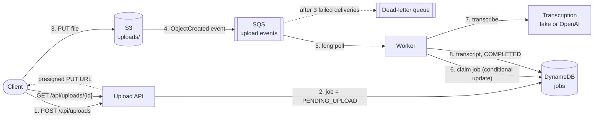
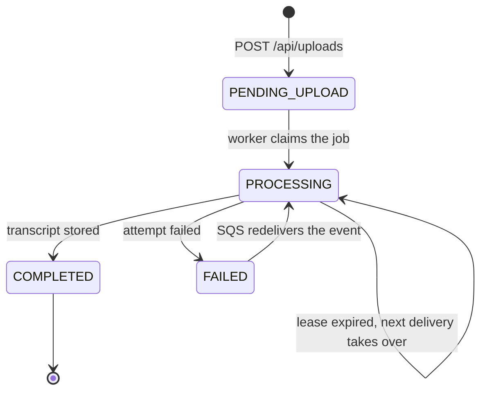

# video-processing-pipeline

[](https://github.com/LindseyZ1205/video-processing-pipeline/actions/workflows/ci.yml)

A Spring Boot service that takes audio and video uploads and transcribes them asynchronously on AWS.

Clients upload straight to S3 with a presigned URL. S3 announces each new object on an SQS queue, and a worker
picks up the event, transcribes the file and records the result in DynamoDB. Every hop delivers at least once, so
the worker is idempotent: it retries transient failures and leaves poison messages in a dead-letter queue.

Everything runs locally on [LocalStack](https://github.com/localstack/localstack). The integration tests run the
whole flow against it with Testcontainers.

**Stack:** Java 17, Spring Boot 3.5, AWS SDK for Java v2 (S3, SQS, DynamoDB), LocalStack, Testcontainers, GitHub Actions.

## Architecture



1. The client asks for an upload. The API checks the file type and declared size, records a `PENDING_UPLOAD` job,
   and returns a presigned PUT URL that is valid for 15 minutes.
2. The client uploads the file directly to S3. The file's bytes never pass through the service.
3. S3 publishes an `ObjectCreated` event for every key under `uploads/` to the SQS queue.
4. The worker long-polls the queue, claims the job in DynamoDB, transcribes the file and stores the transcript.
5. The client polls `GET /api/uploads/{id}` until the job is `COMPLETED`.

A job moves through these states:



## Design decisions

### Presigned URLs instead of uploading through the API

Proxying video through the service would tie up request threads and bandwidth for the length of every upload.
With a presigned URL the service only signs a request, and S3 takes the bytes.

- The URL is valid for 15 minutes and signs the object key and the `Content-Type`. The client can't pick a
  different key or type without breaking the signature.
- The object key is `uploads/{userId}/{uploadId}/{sanitized file name}`. The upload ID is a fresh UUID for every
  URL, so uploads never overwrite each other.
- A presigned PUT can't cap the file size by itself. The API rejects oversized declared sizes, and the worker checks
  the real size with `HeadObject` before it does any work. To enforce the limit inside S3, you would use a
  presigned POST policy with `content-length-range`.

### At-least-once delivery, made safe with idempotency

S3 event notifications and SQS standard queues both deliver *at least once*. The same upload can arrive twice, and
two workers can receive copies at the same moment. Instead of trying to prevent duplicates, the worker makes them
harmless:

- **One job per upload.** The job ID is the upload ID read from the object key, so every copy of an event maps to
  the same DynamoDB item.
- **Claiming is atomic.** A worker claims a job with a single conditional `UpdateItem`. The update succeeds only if
  the job is new, pending, failed, or stuck in `PROCESSING` with an expired lease. DynamoDB evaluates the condition
  and applies the update atomically, so exactly one worker wins.
- **Leases are fenced.** The winning worker gets a random lease token, and completing or failing the job is
  conditioned on that token. A worker that stalls past its lease can't overwrite the result of the worker that took
  over.
- **Losers check why they lost.** If the job is already `COMPLETED`, the message is a duplicate and is deleted. If
  another worker holds a live lease, the message is left on the queue and comes back after the visibility timeout.

The transcription call itself can still run twice in rare cases: for example, a worker dies after transcribing but
before recording the result. That is the at-least-once contract, and `TranscriptionService` implementations must
tolerate it.

### Retries and the dead-letter queue

- A message is deleted only after its job is recorded as done. On any other outcome the message stays on the queue,
  and SQS redelivers it once the visibility timeout expires, so the visibility timeout doubles as the retry delay.
- The worker sets the visibility timeout on every `ReceiveMessage` and uses the same value as the job lease. When a
  crashed worker's message reappears, its lease has already expired, so the next delivery can take over.
- After `maxReceiveCount` (3) deliveries, SQS moves the message to the dead-letter queue. From there it can be
  inspected, and redriven once the cause is fixed.
- Failures that a retry can't fix, like a file over the size limit or a format the provider rejects, mark the job
  `FAILED` and delete the message right away, so they don't use up retries.
- If DynamoDB or S3 is unreachable, the worker doesn't guess. The message stays on the queue.
- S3 also sends an `s3:TestEvent` when a notification is first configured. The worker recognizes it and drops it.

### Pluggable transcription

`TranscriptionService` is a one-method interface:

| Provider | Setting | What it does |
|---|---|---|
| `fake` (default) | nothing | Returns a placeholder transcript. No keys needed, so it runs anywhere, including CI. |
| `openai` | `OPENAI_API_KEY` | Sends the file to OpenAI's `/audio/transcriptions` endpoint (`whisper-1`, 25 MB limit). |

AWS Transcribe would fit behind the same interface. Because Transcribe runs its jobs asynchronously, a production
version would start a Transcribe job and complete the pipeline job from Transcribe's completion event, rather than
block a worker thread while it runs.

## API

**Create an upload**

```http
POST /api/uploads
Content-Type: application/json

{ "userId": "demo-user", "fileName": "team-sync.mp4", "contentType": "video/mp4", "sizeBytes": 10485760 }
```

```http
HTTP/1.1 201 Created
Location: /api/uploads/0f8fad5b-d9cb-469f-a165-70867728950e

{
  "uploadId": "0f8fad5b-d9cb-469f-a165-70867728950e",
  "objectKey": "uploads/demo-user/0f8fad5b-d9cb-469f-a165-70867728950e/team-sync.mp4",
  "uploadUrl": "http://localhost:4566/video-uploads/uploads/demo-user/...&X-Amz-Signature=...",
  "method": "PUT",
  "headers": { "Content-Type": "video/mp4" },
  "expiresAt": "2026-09-28T19:15:00Z"
}
```

Only `audio/*` and `video/*` types are accepted, up to 100 MB. Anything else gets `400` with a problem-details body.
Then upload the file with the returned method, URL and headers:

```bash
curl -X PUT -H "Content-Type: video/mp4" --upload-file team-sync.mp4 "$UPLOAD_URL"
```

**Check the job**

```http
GET /api/uploads/{uploadId}
```

```json
{
  "uploadId": "0f8fad5b-d9cb-469f-a165-70867728950e",
  "status": "COMPLETED",
  "attempts": 1,
  "transcript": "[fake transcript] uploads/demo-user/0f8fad5b-.../team-sync.mp4 (10485760 bytes, video/mp4)",
  "error": null,
  "updatedAt": "2026-09-28T19:00:03.512Z"
}
```

`status` is `PENDING_UPLOAD`, `PROCESSING`, `COMPLETED` or `FAILED`. An unknown ID returns `404`.

## Running locally

You need Java 17 and Docker.

```bash
docker compose up -d
./gradlew bootRun --args='--spring.profiles.active=local'
```

The `local` profile points the AWS clients at LocalStack. On startup it creates the bucket, the queue and its
dead-letter queue, the S3 → SQS notification, and the DynamoDB table. Then open <http://localhost:8080>: a small
page there uploads a file through the whole pipeline and shows the transcript.

For real transcriptions:

```bash
OPENAI_API_KEY=sk-... ./gradlew bootRun --args='--spring.profiles.active=local --pipeline.transcription.provider=openai'
```

## Infrastructure

[`infra/terraform`](infra/terraform) defines everything the service needs in AWS:

- the upload bucket: private, encrypted, with a CORS rule for browser uploads and a lifecycle rule;
- the S3 → SQS notification, plus the queue policy that allows it;
- the event queue and its dead-letter queue;
- the jobs table with TTL;
- a least-privilege IAM policy for the service's role.

The service is configured entirely from one Terraform output, `service_environment`.

CI applies this configuration to LocalStack on every push. It then starts the service with only the Terraform
outputs, with the in-app bootstrap turned off, and runs [`scripts/smoke-test.sh`](scripts/smoke-test.sh): request an
upload, PUT a file, wait for the transcript. That tests the infrastructure code and the service against each other,
not only each one on its own. [infra/terraform/README.md](infra/terraform/README.md) explains how to apply it to AWS.

## Tests

```bash
./gradlew test
```

The integration tests need Docker. They run on every push in [GitHub Actions](.github/workflows/ci.yml).

- `PipelineIntegrationTest` starts LocalStack with Testcontainers and runs the real flow: presigned upload,
  S3 notification, SQS, worker, DynamoDB. The visibility timeout is shortened to 3 seconds so retries are quick. It
  checks that:
  - an uploaded file ends up `COMPLETED` with its transcript;
  - the same event delivered three times is transcribed exactly once;
  - a failed attempt is retried and then succeeds;
  - an event that keeps failing lands in the dead-letter queue after 3 attempts.
- `UploadEventHandlerTest` covers the delete-or-keep decision for each situation: success, duplicate, lease held
  elsewhere, lease lost, transient failure, permanent failure, unreachable job store, S3 test event.
- `OpenAiTranscriptionServiceTest` checks the multipart request and how errors are classified, against a mock server.
- `S3EventNotificationTest` and `UploadKeyTest` cover event parsing (including URL-encoded keys) and key sanitizing.
- The `terraform + smoke test` CI job checks `terraform fmt`, applies [`infra/terraform`](infra/terraform) to
  LocalStack, and runs the smoke test against the service configured from the Terraform outputs.

## Configuration

All settings live under `pipeline.*` in [`application.yml`](src/main/resources/application.yml).

| Property | Default | Meaning |
|---|---|---|
| `pipeline.aws.endpoint` | empty | AWS endpoint override, e.g. `http://localhost:4566` for LocalStack |
| `pipeline.aws.bootstrap-resources` | `false` | Create the bucket, queues and table on startup (LocalStack only) |
| `pipeline.bucket` | `video-uploads` | Upload bucket |
| `pipeline.queue.name` / `dead-letter-name` | `video-upload-events` / `…-dlq` | Event queue and its DLQ |
| `pipeline.queue.max-receive-count` | `3` | Deliveries before a message moves to the DLQ |
| `pipeline.upload.url-ttl` | `15m` | Presigned URL lifetime |
| `pipeline.upload.max-file-size` | `100MB` | Size limit, checked at upload request and again by the worker |
| `pipeline.worker.concurrency` | `2` | Poller threads |
| `pipeline.worker.visibility-timeout` | `60s` | Retry delay and job lease; keep it above the longest transcription |
| `pipeline.jobs.retention` | `7d` | Job records expire through DynamoDB TTL on `expiresAt` |
| `pipeline.transcription.provider` | `fake` | `fake` or `openai` |

Against real AWS, leave the endpoint empty so the SDK uses its default credential chain. The resource names come
from `terraform output -json service_environment` ([Infrastructure](#infrastructure)), not from `bootstrap-resources`.
Environment variables such as `PIPELINE_BUCKET` override any of these settings.

## Project layout

```
src/main/java/io/github/lindseyz1205/videopipeline/
├── upload/         REST API, presigned URLs, object key layout
├── processing/     SQS poller, S3 event parsing, idempotent event handler
├── job/            job state and leases in DynamoDB
├── transcription/  TranscriptionService and its fake / OpenAI providers
└── config/         AWS clients, settings, LocalStack bootstrap
infra/terraform/    AWS resources and the service's IAM policy
scripts/            end-to-end smoke test
```

## Not covered yet

- **Authentication.** `userId` comes from the request body. A real service would take it from the caller's identity.
- **Long transcriptions.** The worker should keep extending the message visibility while it works (a heartbeat),
  instead of relying on one fixed timeout.
- **Deployment.** Terraform covers the resources the service uses, not where the service runs. There is no container
  image, no compute (ECS, App Runner) and no remote Terraform state yet.
- **Large files.** Multipart uploads, and a POST policy to enforce the size limit in S3.
- **Observability.** Metrics and alarms on queue age and dead-letter queue depth.

## License

[MIT](LICENSE)
